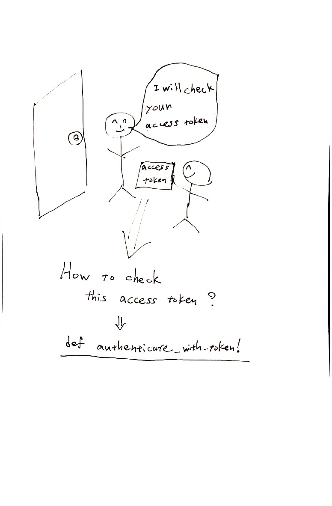
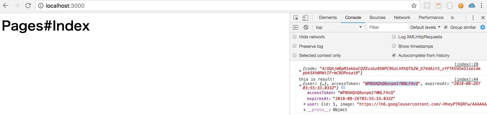
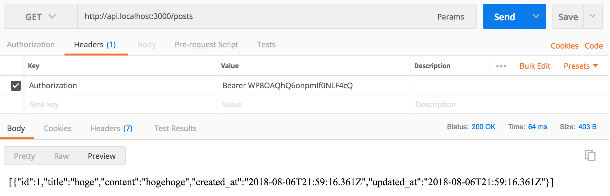
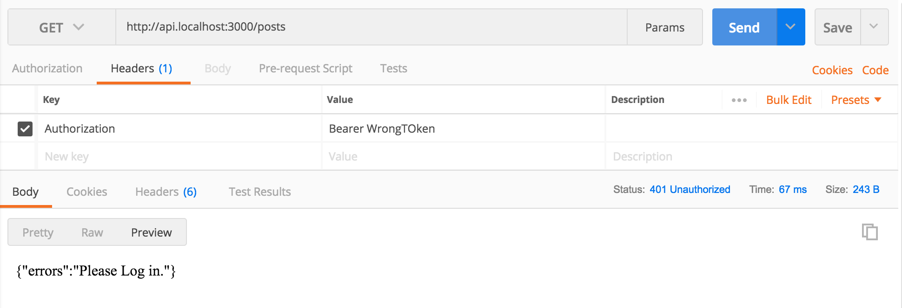

# Chap9 Authable Concerns

In the last chapter, we made access token.


### make Authable concerns



```ruby
module Authable
end
```






If you're not familiar with concern, just think it is like helpers.




### Define `authenticate_with_token!`



```ruby
module Authable
  def user_have_valid_token?
    # Find token in database from bearer_token
    token = AccessToken.find_token(bearer_token)
    # 1. Check token exist
    # 2. Check token is not expired
    token && !token.expired?
  end

  def authenticate_with_token!
    render json: { errors: "Please Log in." }, status: :unauthorized unless user_have_valid_token?
  end

  # Find bearer token from request
  def bearer_token
    pattern = /^Bearer /
    header  = request.headers['Authorization']
    header.gsub(pattern, '') if header && header.match(pattern)
  end
end
```




### Add new methods in `access_token.rb`

`self.find_token(bearer_token)` and `expired?` 



```ruby
# == Schema Information
#
# Table name: access_tokens
#
#  id           :bigint(8)        not null, primary key
#  expires_at   :datetime
#  token_digest :string
#  created_at   :datetime         not null
#  updated_at   :datetime         not null
#  user_id      :bigint(8)
#
# Indexes
#
#  index_access_tokens_on_token_digest  (token_digest)
#  index_access_tokens_on_user_id       (user_id)
#
# Foreign Keys
#
#  fk_rails_...  (user_id => users.id)
#

class AccessToken < ApplicationRecord
  belongs_to :user
  # you can write code like below if you add 'attr_accessor'
  # even if there is no column 'token' in AccessToken database
  # ex. access_token = AccessToken.generate_token(user)
  # access_token.token
  attr_accessor :token

  def self.generate_token(user)
    # 1. create randam token
    token = self.new_token
    # 2. create digest of randam token
    token_digest = self.digest_token(token)
    # 3. set expires datetime
    expires_at = 14.days.from_now
    # 4. create AccessToken model by the above info
    AccessToken.create(token: token, token_digest: token_digest, expires_at: expires_at, user: user)
  end

  def self.new_token
    SecureRandom.urlsafe_base64
  end

  def self.digest_token(token)
    Digest::SHA256.hexdigest(token)
  end

  def self.find_token(bearer_token)
    # https://github.com/plataformatec/devise/blob/715192a7709a4c02127afb067e66230061b82cf2/lib/devise/token_generator.rb#L12
    token_digest = Digest::SHA256.hexdigest(bearer_token) if bearer_token
    AccessToken.find_by(token_digest: token_digest)
  end
  
  def expired?
    expires_at < Time.now
  end
end

```







### Include Authable in application\_controller.rb



```ruby
class ApplicationController < ActionController::API
  include Authable
end
```




### Check How it works!

Add below code in `posts_controller.rb`

```text
before_action :authenticate_with_token!, only: [:index]
```




```ruby
class Api::PostsController < ApplicationController
  before_action :authenticate_with_token!, only: [:index]
  def index
    render json: Post.all
  end
end
```




###  Copy `accessToken` in client by Console.log

To test Postman, we need to `console.log` `accessToken` and copy it

```text
console.log('this is result!',result)
```




```markup
...
<script>
function signInCallback(authResult) {
  if (authResult['code']) {
    console.log(authResult)
    // Hide the sign-in button now that the user is authorized, for example:
    $('#signinButton').attr('style', 'display: none');
    // Send the code to the server
    /* We need to implement backend endpoint here */
    $.ajax({
      type: 'POST',
      url: 'http://api.localhost:3000/auth/google_oauth2/callback',
      data: authResult,
      // Always include an `X-Requested-With` header in every AJAX request,
      // to protect against CSRF attacks.
      headers: {
        'X-Requested-With': 'XMLHttpRequest'
      },
      success: function(result) {
        // Handle or verify the server response.
        console.log('this is result!',result)
      },
    });
  } else {
    // There was an error.
  }
}
</script>
```





**Copy the `accessToken`**


### Test with Postman



If you change the token



It renders errors message.

### Reference in this chapter








In clearance `authenticate_with_token!` is `require_login`



