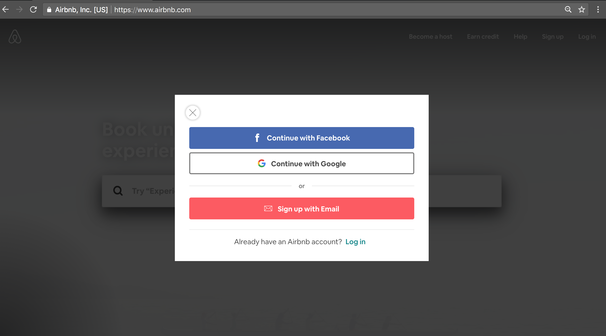
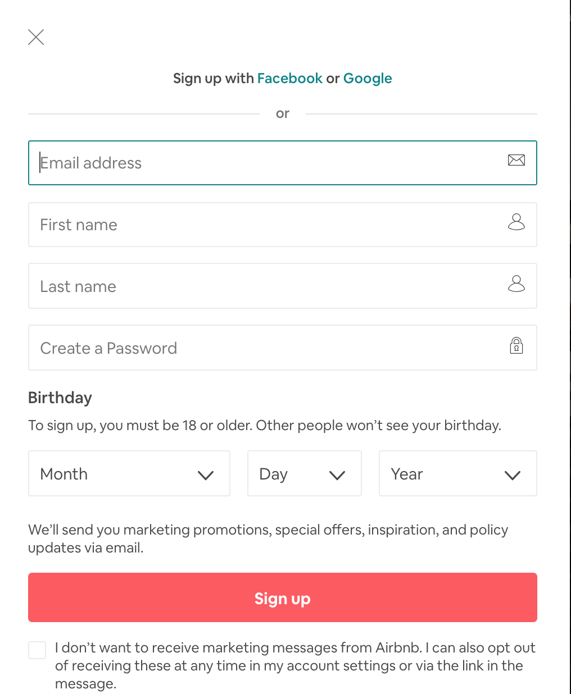
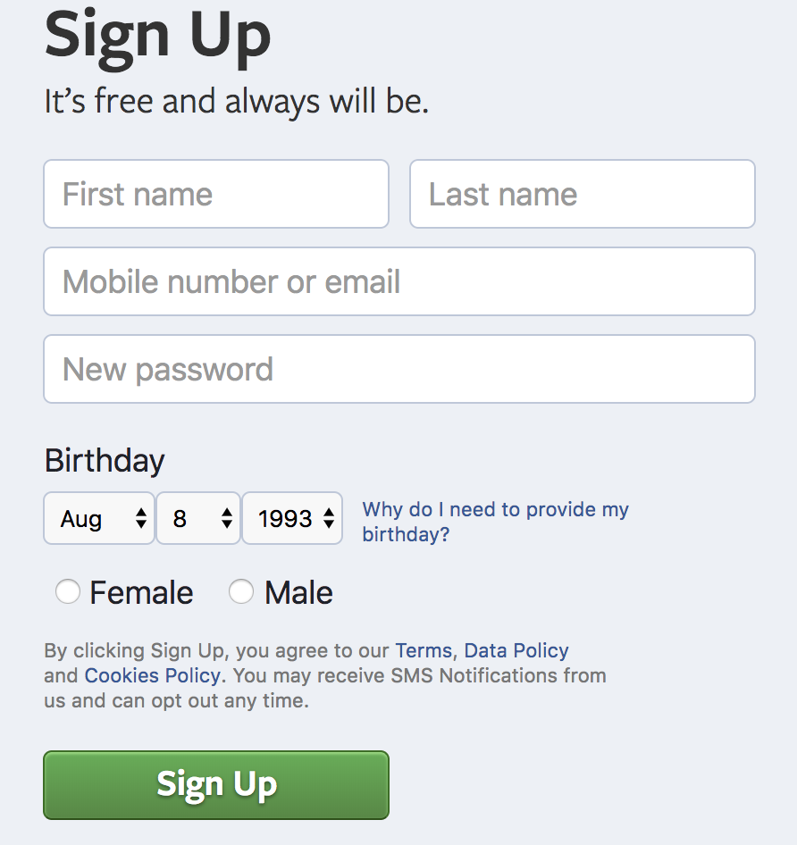

# Chap2 Authentication Overview

### Session or Token Authentication ?

There are many many tutorial, stackoverflow and blog post etc ...

I was exhausted from searching about that :\(

But the below one is really really really well summarized.



{% embed data="{\"url\":\"https://docs.google.com/spreadsheets/d/1tAX5ZJzluilhoYKjra-uHbMCZraaQkqIHl3RIQ8mVkM/edit\#gid=0\",\"type\":\"rich\",\"title\":\"Authentication Techniques for APIs\",\"description\":\"Sheet1   HTTP Basic Auth, Stateless Session Cookie, JWT, Stateful Session Cookie, Random Token, Full Request Signature, OAuth  Description, Pass username and password with every request, Signed or encrypted cookie with user information. Usually handled by web framework., Signed or encrypted user ...\",\"icon\":{\"type\":\"icon\",\"url\":\"https://ssl.gstatic.com/docs/spreadsheets/favicon\_jfk2.png\",\"aspectRatio\":0},\"thumbnail\":{\"type\":\"thumbnail\",\"url\":\"https://lh4.googleusercontent.com/3f6TZ4AGolg2KiNAo3-0RBZ4XxBpPmTcSLKYDyK-BWdxZmFrNiJN9ydAJksH92bvxJBvfQ=w1200-h630-p\",\"width\":1200,\"height\":630,\"aspectRatio\":0.525},\"embed\":{\"type\":\"reader\",\"url\":\"https://docs.google.com/spreadsheets/d/1tAX5ZJzluilhoYKjra-uHbMCZraaQkqIHl3RIQ8mVkM/preview?usp=embed\_googleplus\",\"html\":\"
<iframe src=\\\"https://docs.google.com/spreadsheets/d/1tAX5ZJzluilhoYKjra-uHbMCZraaQkqIHl3RIQ8mVkM/preview?usp=embed\_googleplus\\\" style=\\\"border: 0; top: 0; left: 0; width: 100%; height: 100%; position: absolute;\\\" allowfullscreen></iframe>
\",\"aspectRatio\":1.4142}}" %}

> ### Use Case 1. API for Single Page Application
>
> 1. **Will mobile applications to use the same APIs?** If yes, prefer token-based authentication \(but ensure a separate API is built for these use cases\)

### What about Jwt ?



{% embed data="{\"url\":\"https://github.com/shieldfy/API-Security-Checklist/issues/6\",\"type\":\"link\",\"title\":\"Don\'t recommend JWT · Issue \#6 · shieldfy/API-Security-Checklist\",\"description\":\"don&\#39;t use JWT. JWT terrifies me, and it terrifies all the crypto engineers I know. As a security standard, it is a series of own-goals foreseeable even 10 years ago based on the history of cryp...\",\"icon\":{\"type\":\"icon\",\"url\":\"https://github.com/fluidicon.png\",\"aspectRatio\":0},\"thumbnail\":{\"type\":\"thumbnail\",\"url\":\"https://avatars0.githubusercontent.com/u/1235441?s=400&v=4\",\"width\":400,\"height\":400,\"aspectRatio\":1}}" %}

{% embed data="{\"url\":\"https://scotch.io/bar-talk/why-jwts-suck-as-session-tokens\",\"type\":\"link\",\"title\":\"Why JWTs Suck as Session Tokens\",\"description\":\"JSON Web Tokens \(JWTs\) are so hot right now. They’re all the rage in web development: Trendy? ✓ Secure? ✓\",\"icon\":{\"type\":\"icon\",\"url\":\"https://scotch.io/img/icons/gold/favicon-196x196.png\",\"width\":196,\"height\":196,\"aspectRatio\":1},\"thumbnail\":{\"type\":\"thumbnail\",\"url\":\"https://cdn.scotch.io/36632/ET37xuP9RiCC9UOFvsYA\_PWA%20Post%20Header%E2%80%93JWTs%20suck.png.jpg\",\"width\":1500,\"height\":750,\"aspectRatio\":0.5}}" %}

{% embed data="{\"url\":\"https://speakerdeck.com/rdegges/jwts-suck-and-are-stupid\",\"type\":\"video\",\"title\":\"JWTs Suck \(and Are Stupid\)\",\"icon\":{\"type\":\"icon\",\"url\":\"https://d2dfho4r6t7asi.cloudfront.net/assets/favicon-c0fe5475f88a65b817c8cc7c0fedc01b7acc17fe27628fa13ca3f96e56e16977.png\",\"aspectRatio\":0},\"thumbnail\":{\"type\":\"thumbnail\",\"url\":\"https://speakerd.s3.amazonaws.com/presentations/e490a33dead64c2eb9a932685f3f644f/slide\_0.jpg\",\"width\":1024,\"height\":576,\"aspectRatio\":0.5625},\"embed\":{\"type\":\"player\",\"url\":\"//speakerdeck.com/player/e490a33dead64c2eb9a932685f3f644f\",\"html\":\"
<iframe src=\\\"//speakerdeck.com/player/e490a33dead64c2eb9a932685f3f644f\\\" style=\\\"border: 0; top: 0; left: 0; width: 100%; height: 100%; position: absolute;\\\" allowfullscreen scrolling=\\\"no\\\"></iframe>
\",\"aspectRatio\":1.5335}}" %}

### Conclusion about authentication strategy

 **=&gt; Use token authentication without jwt**

Below resources are the token authentication flow without jwt.



{% embed data="{\"url\":\"https://github.com/lynndylanhurley/devise\_token\_auth\",\"type\":\"link\",\"title\":\"lynndylanhurley/devise\_token\_auth\",\"description\":\"devise\_token\_auth - Token based authentication for Rails JSON APIs. Designed to work with jToker and ng-token-auth.\",\"icon\":{\"type\":\"icon\",\"url\":\"https://github.com/fluidicon.png\",\"aspectRatio\":0},\"thumbnail\":{\"type\":\"thumbnail\",\"url\":\"https://avatars0.githubusercontent.com/u/468037?s=400&v=4\",\"width\":400,\"height\":400,\"aspectRatio\":1}}" %}

{% embed data="{\"url\":\"https://github.com/gonzalo-bulnes/simple\_token\_authentication\",\"type\":\"link\",\"title\":\"gonzalo-bulnes/simple\_token\_authentication\",\"description\":\"simple\_token\_authentication - Simple \(but safe\) token authentication for Rails apps or API with Devise.\",\"icon\":{\"type\":\"icon\",\"url\":\"https://github.com/fluidicon.png\",\"aspectRatio\":0},\"thumbnail\":{\"type\":\"thumbnail\",\"url\":\"https://avatars1.githubusercontent.com/u/1619067?s=400&v=4\",\"width\":400,\"height\":400,\"aspectRatio\":1}}" %}



### Login Strategy

This is a Airbnb Sign\_up page.

In Airbnb, there are 3 options to sign up.

1. Facebook Login
2. Google Login
3. Email Login

### Social Login

Facebook Login and Google Login are both "Social Login".

We don't need to store "password".

### Email Login

We need to ask user to create "password" and then store it in our database.

_Are you use same password across multiple sites ?_

My answer is _Yes_.

This means we needs to really really care about security.

### Conclusion about login strategy

I choose to use 

_**Google Login**_

**=&gt; Simple, Enough, and guarantee that user have email**

Facebook user who sign up by phone number don't have email.

