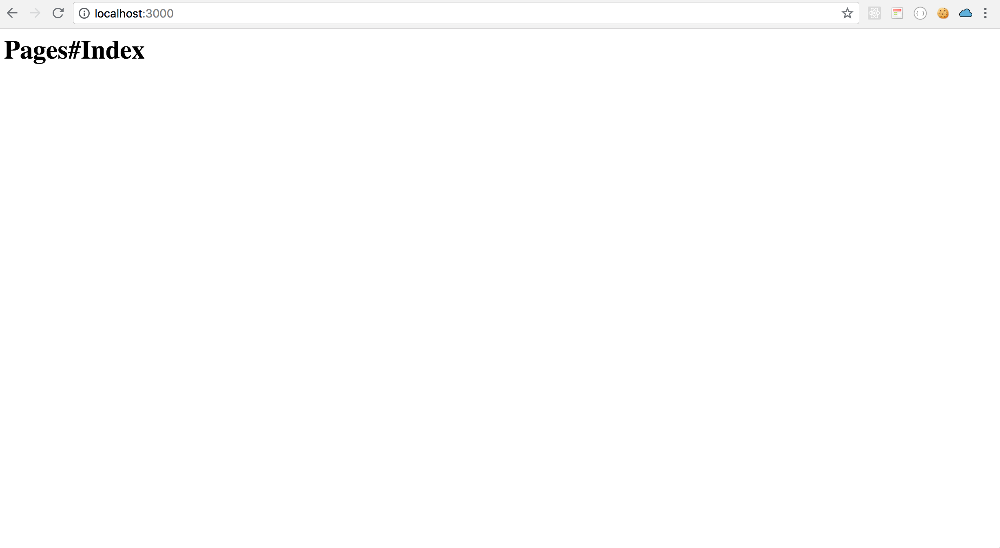

# Chap3 Prepare Google Sign-in

### Chapter Overview

In this chapter, we are going to learn **Google Sign-in Flow.** 

### What about omniauth ?

If you have experienced implementing google login on rails,  you may use omniauth-google-oauth2 gem.



When I first implement the google login for rails-api, I did the same thing with the traditional rails web site.

**It worked ! But ...**

**It didn't work well for** _**multiple client**_**.**

We plan to implement the api for multiple client, so we need to think alternatives.

Super Fortunately, the gem already solved this problem !!!!!!!! 

Check the below url.

[https://github.com/zquestz/omniauth-google-oauth2\#one-time-code-flow-hybrid-authentication](https://github.com/zquestz/omniauth-google-oauth2#one-time-code-flow-hybrid-authentication)

In the above documents, they pointed to the below url.

{% embed data="{\"url\":\"https://developers.google.com/identity/sign-in/web/server-side-flow\",\"type\":\"link\",\"title\":\"Google Sign-In for server-side apps  \|  Google Sign-In for Websites        \|  Google Developers\",\"icon\":{\"type\":\"icon\",\"url\":\"https://developers.google.com/\_static/08eb25dae9/images/touch-icon.png\",\"aspectRatio\":0},\"thumbnail\":{\"type\":\"thumbnail\",\"url\":\"https://developers.google.com/\_static/08eb25dae9/images/share/devsite-light-green.png\",\"width\":1200,\"height\":630,\"aspectRatio\":0.525}}" %}

### 

### Google Official docs shows another way

[https://developers.google.com/identity/sign-in/web/backend-auth](https://developers.google.com/identity/sign-in/web/backend-auth)

In this documents, it shows the _**flow of backend to verify id\_token**_.

This is another way of omniauth.

But there is no feature in ruby client currently. [https://github.com/google/google-api-ruby-client/issues/596](https://github.com/google/google-api-ruby-client/issues/596)

So, you need to call [tokeninfo endpoint](https://developers.google.com/identity/sign-in/web/backend-auth#calling-the-tokeninfo-endpoint)

### Conclusion about flow

So, I think it is better to use the way  [omniauth-google-oauth2 shows](https://github.com/zquestz/omniauth-google-oauth2#one-time-code-flow-hybrid-authentication).


### Preparation: Make dummy client in rails app

To make **Googl sign-in** button, we need "Client".

Client is ...

1. Mobile app
2. Spa app \(React, Vue, Angular\)
3. Web app \(Rails view\)

I'll choose "**3**" for simplicity.

But the flow is same with SPA or Native Mobile \(I'll show you how to implement by React in the client tutorial \).

Okay, Let's start !

### Routes

Add routes for dummy page.

```text
root to: 'pages#index'
```




```ruby
Rails.application.routes.draw do
  root to: 'pages#index'
  
  namespace :api, path: '', constraints: { subdomain: 'api' } do
    resources :posts
  end
end
```



### Controller

Add controller

**\*NOTE!!**

**Inherit** `ActionController::Base` not `ApplicationController`

`ApplicationController`  inherits `ActionController::API` 

This is for api and not render views.

```text
rails g controller pages
```



```ruby
class PagesController < ActionController::Base
  def index
  end
end
```



### Views

Just make new views



```markup
<h1>Pages#Index</h1>
```



#### 

### Check 

```text
rails s
```



Okay! It worked!

In the next chapter, we are going to implement google sign-in button following the official docs! 


