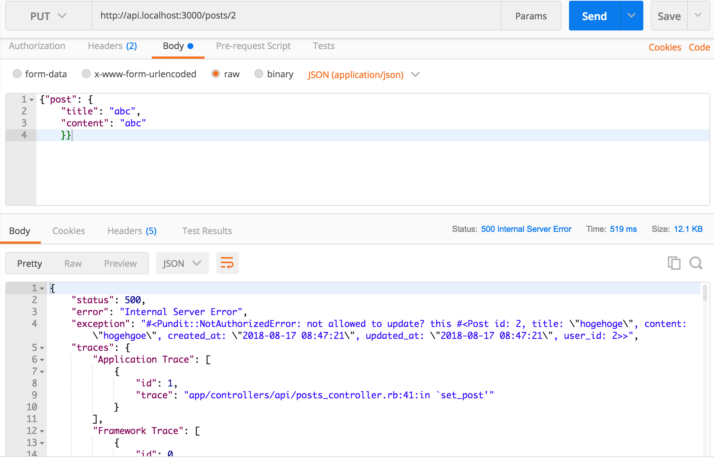
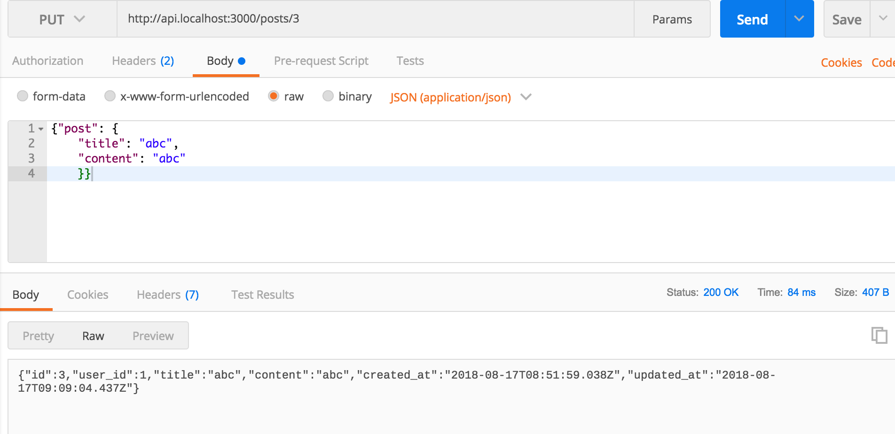
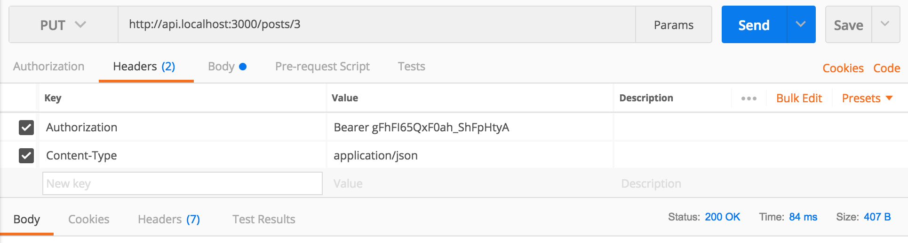

# Chap11 Pundit Authorization

### Install Pundit




```text
gem "pundit"
```

```text
bundle
```




```ruby
class ApplicationController < ActionController::API
  include Authable
  include Pundit
end
```




```text
rails g pundit:install
```


```text
Running via Spring preloader in process 23056
      create  app/policies/application_policy.rb
```


It creates `application_policy.rb` 

This is "**default"** policy settings.



```ruby
class ApplicationPolicy
  attr_reader :user, :record

  def initialize(user, record)
    @user = user
    @record = record
  end

  def index?
    false
  end

  def show?
    scope.where(:id => record.id).exists?
  end

  def create?
    false
  end

  def new?
    create?
  end

  def update?
    false
  end

  def edit?
    update?
  end

  def destroy?
    false
  end

  def scope
    Pundit.policy_scope!(user, record.class)
  end

  class Scope
    attr_reader :user, :scope

    def initialize(user, scope)
      @user = user
      @scope = scope
    end

    def resolve
      scope
    end
  end
end
```




### Edit Default `application_policy.rb`

Delete unnecessary default action.

`new?` `edit?`

is **Not needed.**

**In each action, we define the conditional statements**



```ruby
class ApplicationPolicy
  attr_reader :user, :record

  def initialize(user, record)
    @user = user
    @record = record
  end

  def index?
    # always true => everyone can access
    true
  end

  def show?
    # if record exists => true
    scope.where(:id => record.id).exists?
  end

  def create?
    # if current_user present => true
    # Pundit will call the current_user method to retrieve
    # what to send into this argument
    # https://github.com/varvet/pundit#policies
    user.present?
  end

  def update?
    # If current_user present && 
    # record.user == user
    user.present? && record.user == user
  end

  def destroy?
    user.present? && record.user == user
  end
  
  # https://github.com/varvet/pundit#manually-retrieving-policies-and-scopes
  def scope
    Pundit.policy_scope!(user, record.class)
  end

  class Scope
    attr_reader :user, :scope

    def initialize(user, scope)
      @user = user
      @scope = scope
    end

    def resolve
      scope
    end
  end
end
```




### Generate Policy for Post

Use [generator](https://github.com/varvet/pundit#generator)

```text
rails g pundit:policy post
```


```text
Running via Spring preloader in process 23540
      create  app/policies/post_policy.rb
      invoke  rspec
      create    spec/policies/post_policy_spec.rb
```


`post_policy.rb` inherits `application_policy.rb` 

So, the same policy settings applied.



```ruby
class PostPolicy < ApplicationPolicy
  class Scope < Scope
    def resolve
      scope
    end
  end
end
```




### How to use policy ?



```ruby
class Api::PostsController < ApplicationController
...
  def update
    authorize @post
    if @post.update(post_params)
      render json: @post, status: :ok
    else
      render json: @post.errors, status: :unprocessable_entity
    end
  end
end
```



`authorize` is something like ...

**This is super Important to understand!!!**

```ruby
unless PostPolicy.new(current_user, @post).update?
  raise Pundit::NotAuthorizedError, "not allowed to update? this #{@post.inspect}"
end
```


### What is 'user' ?

> * The first argument is a user. In your controller, Pundit will call the `current_user` method to retrieve what to send into this argument

Pundit automatically detect `current_user` method. If someone don't use

`current_user` method, they need to [customize](https://github.com/varvet/pundit#customize-pundit-user). But We don't need it.

### What is 'record' ?

> * The second argument is some kind of model object, whose authorization you want to check. This does not need to be an ActiveRecord or even an ActiveModel object, it can be anything really.


### Complete posts\_controller.rb



```ruby
class Api::PostsController < ApplicationController
  before_action :set_post, only: [:show, :update, :destroy]
  before_action :authenticate_with_token!, only: [:create, :update, :destroy]
  after_action :verify_authorized

  def index
    render json: Post.all
    authorize Post
  end

  def show
    render json: @post
  end

  def create
    @post = current_user.posts.new(post_params)
    authorize @post
    if @post.save
      render json: @post, status: :created
    else
      render json: @post.errors, status: :unprocessable_entity
    end
  end

  def update
    if @post.update(post_params)
      render json: @post, status: :ok
    else
      render json: @post.errors, status: :unprocessable_entity
    end
  end

  def destroy
    @post.destroy
    head :no_content
  end

  private
  def set_post
    @post = Post.find(params[:id])
    authorize @post
  end

  def post_params
    params.require(:post).permit(:title, :content)
  end
end
```




`after_action :verify_authorized` is for development 

> Thankfully, Pundit has a handy feature which reminds you in case you forget. Pundit tracks whether you have called `authorize` anywhere in your controller action. Pundit also adds a method to your controllers called `verify_authorized`. This method will raise an exception if `authorize` has not yet been called. You should run this method in an `after_action`hook to ensure that you haven't forgotten to authorize the action.

### Test!

**create dummy user and posts**

```text
rails c
```

```text
@user2 = User.create(email:"hogehoge@hoge.com")
```

```text
@user2.posts.create(title:"hogehoge", content:"hogehgoe")
```


```text
@user1 = User.first
```

```text
@user1.posts.create(title:"hogehoge", content:"hogehgoe")
```


**Test with postman**

User-1 **cannot** update post 2.



It throws Pundit Exception Error.

User-1 **can** update post 3






### Scope

Just show example which is commented out.



```ruby
class PostPolicy < ApplicationPolicy
  class Scope < Scope
    def resolve
      scope
    end
    
    # def resolve
    #   if user.admin?
    #     scope.all
    #   else
    #     scope.where(published: true)
    #   end
    # end
  end
end
```




### Ruby class memo

{% embed data="{\"url\":\"https://forum.upcase.com/t/using-instance-variables-vs-attribute-accessors/1788\",\"type\":\"link\",\"title\":\"Using instance variables vs attribute accessors\",\"description\":\"When you are accessing private, internal state of your object, do you prefer to use attribute accessors \(getter and setter methods\) or direct instance variable access? Consider this contrived example:  class LineItem   def initialize\(item, quantity\)     @item = item     @quantity = quantity   end    \# Access our internal state via instance variables   def total     @item.price \* @quantity   end    \# Or via attr\_readers   def total     item.price \* quantity   end    \#... which would require somet...\",\"icon\":{\"type\":\"icon\",\"url\":\"https://forum.upcase.com/images/default-apple-touch-icon.png\",\"aspectRatio\":0},\"thumbnail\":{\"type\":\"thumbnail\",\"url\":\"https://forum.upcase.com/images/default-apple-touch-icon.png\",\"aspectRatio\":0}}" %}


