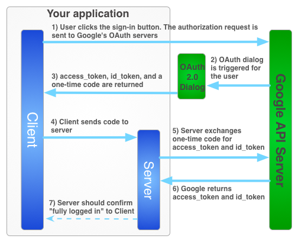
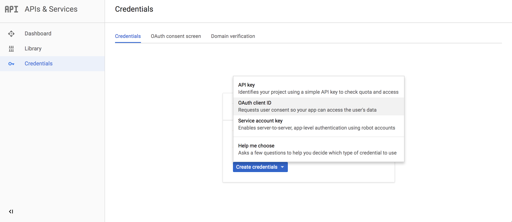
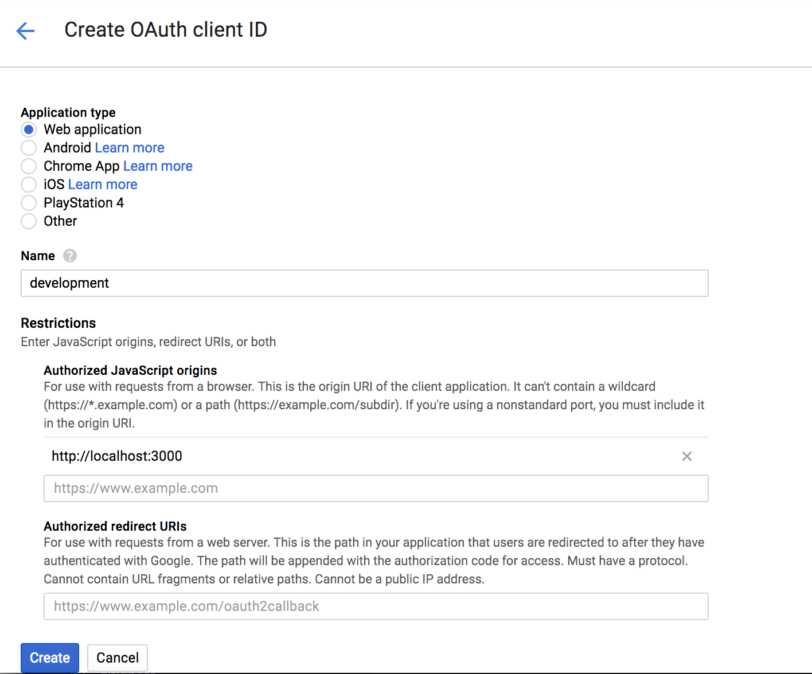
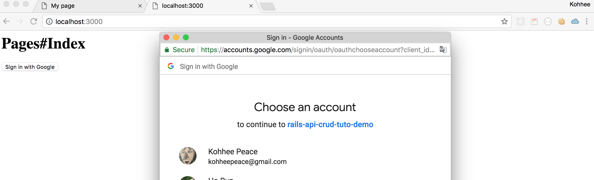

# Chap4 Implement Google-Sign-in

### Chapter Overview

In this chapter, we are going to make **Google Sign-in Button.** 

### Follow the Official Docs

Let's follow the Official docs step by step !

{% embed data="{\"url\":\"https://developers.google.com/identity/sign-in/web/server-side-flow\",\"type\":\"link\",\"title\":\"Google Sign-In for server-side apps  \|  Google Sign-In for Websites        \|  Google Developers\",\"icon\":{\"type\":\"icon\",\"url\":\"https://developers.google.com/\_static/08eb25dae9/images/touch-icon.png\",\"aspectRatio\":0},\"thumbnail\":{\"type\":\"thumbnail\",\"url\":\"https://developers.google.com/\_static/08eb25dae9/images/share/devsite-light-green.png\",\"width\":1200,\"height\":630,\"aspectRatio\":0.525}}" %}



#### Step 1: Create a client ID and client secret {#step_1_create_a_client_id_and_client_secret}





#### Step 2: Include the Google platform library on your page {#step_2_include_the_google_platform_library_on_your_page}



```markup
<h1>Pages#Index</h1>
<script src="//ajax.googleapis.com/ajax/libs/jquery/1.8.2/jquery.min.js">
</script>
<script src="https://apis.google.com/js/client:platform.js?onload=start" async defer>
</script>
```




#### Step 3: Initialize the GoogleAuth object {#step_3_initialize_the_googleauth_object}



```markup
<h1>Pages#Index</h1>
<script src="//ajax.googleapis.com/ajax/libs/jquery/1.8.2/jquery.min.js">
</script>
<script src="https://apis.google.com/js/client:platform.js?onload=start" async defer>
</script>
<script>
  function start() {
    gapi.load('auth2', function() {
      auth2 = gapi.auth2.init({
        client_id: 'YOUR_CLIENT_ID.apps.googleusercontent.com',
        // Scopes to request in addition to 'profile' and 'email'
        //scope: 'additional_scope'
      });
    });
  }
</script>
```




#### Step 4: Add the sign-in button to your page {#step_4_add_the_sign-in_button_to_your_page}



```markup
<h1>Pages#Index</h1>
<button id="signinButton">Sign in with Google</button>

<script src="//ajax.googleapis.com/ajax/libs/jquery/1.8.2/jquery.min.js">
</script>
<script src="https://apis.google.com/js/client:platform.js?onload=start" async defer>
</script>
<script>
  function start() {
    gapi.load('auth2', function() {
      auth2 = gapi.auth2.init({
        client_id: 'YOUR_CLIENT_ID.apps.googleusercontent.com',
        // Scopes to request in addition to 'profile' and 'email'
        //scope: 'additional_scope'
      });
    });
  }
</script>
<script>
  $('#signinButton').click(function() {
    // signInCallback defined in step 6.
    auth2.grantOfflineAccess().then(signInCallback);
  });
</script>
```



#### Step 5: Sign in the user {#step_5_sign_in_the_user}



#### Step 6: Send the authorization code to the server {#step_6_send_the_authorization_code_to_the_server}



```markup
<h1>Pages#Index</h1>
<button id="signinButton">Sign in with Google</button>

<script src="//ajax.googleapis.com/ajax/libs/jquery/1.8.2/jquery.min.js">
</script>
<script src="https://apis.google.com/js/client:platform.js?onload=start" async defer>
</script>
<script>
  function start() {
    gapi.load('auth2', function() {
      auth2 = gapi.auth2.init({
        client_id: '599452345899-rbpa86it53ba6pr6jtgsimbhpddkvdka.apps.googleusercontent.com',
        // Scopes to request in addition to 'profile' and 'email'
        //scope: 'additional_scope'
      });
    });
  }
</script>
<script>
  $('#signinButton').click(function() {
    // signInCallback defined in step 6.
    auth2.grantOfflineAccess().then(signInCallback);
  });
</script>
<script>
function signInCallback(authResult) {
  if (authResult['code']) {

    // Hide the sign-in button now that the user is authorized, for example:
    $('#signinButton').attr('style', 'display: none');

    // Send the code to the server
    $.ajax({
      type: 'POST',
      url: 'http://example.com/storeauthcode',
      // Always include an `X-Requested-With` header in every AJAX request,
      // to protect against CSRF attacks.
      headers: {
        'X-Requested-With': 'XMLHttpRequest'
      },
      contentType: 'application/octet-stream; charset=utf-8',
      success: function(result) {
        // Handle or verify the server response.
      },
      processData: false,
      data: authResult['code']
    });
  } else {
    // There was an error.
  }
}
</script>
```



Here we call the ajax Post request to the sever endpoint.

In the next chapter, we will implement the server endpoint with omniauth!


