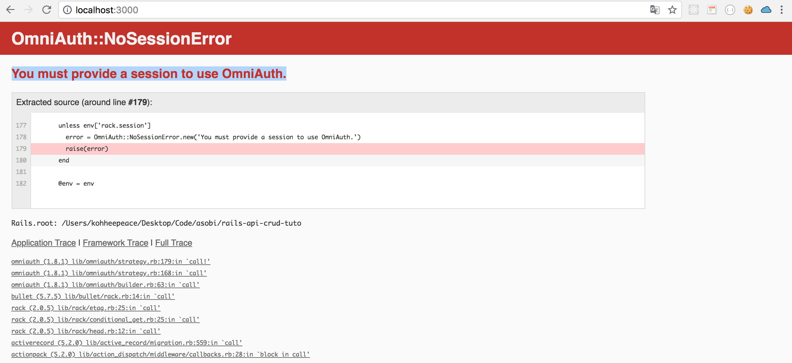
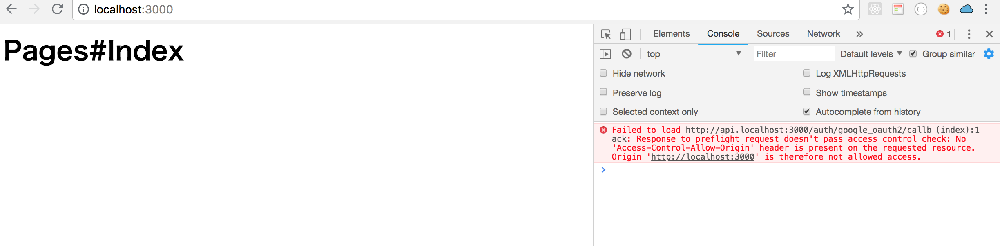
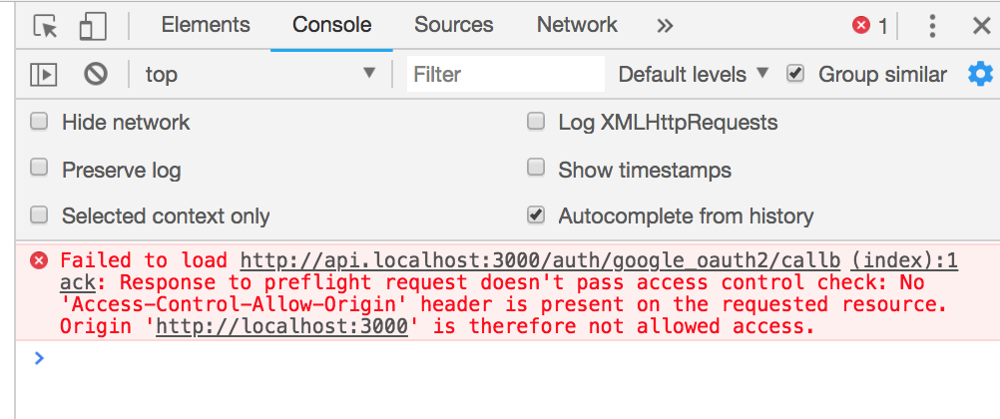
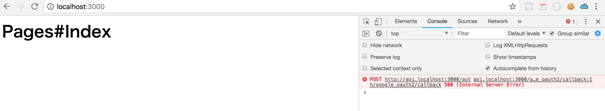
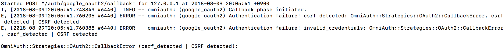
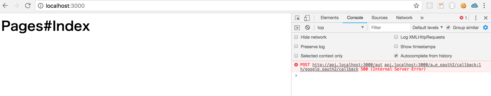
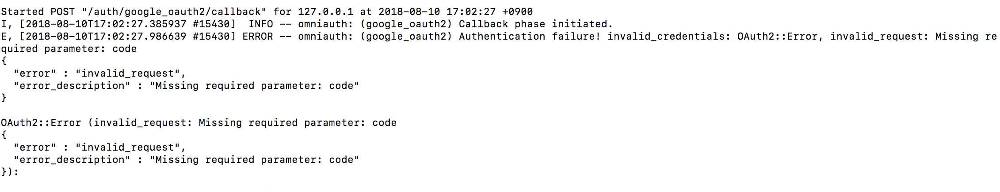
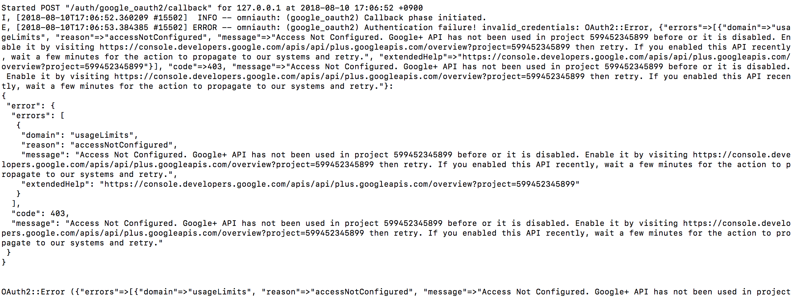
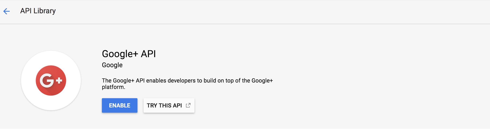
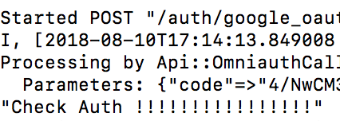

# Chap5 Add Server Omniauth



```text
gem 'omniauth-google-oauth2'
```



```text
bundle
```

### Create config/initializers/omniauth.rb



```ruby
Rails.application.config.middleware.use OmniAuth::Builder do
  provider :google_oauth2, ENV['GOOGLE_CLIENT_ID'], ENV['GOOGLE_CLIENT_SECRET']
end
```




### Figaro

Use figaro gem to securely configure secrets key





```text
gem "figaro"
```



```text
bundle
```

Run figaro command in terminal

```text
bundle exec figaro install
```

It create `application.yml` and edit `.gitignore`

```text
create  config/application.yml
append  .gitignore
```

In `application.yml` add Google client\_id and secret



```yaml
development:
  GOOGLE_CLIENT_ID: "599452345899-rbpa86it53ba6pr6jtgsimbhpddkvdka.apps.googleusercontent.com"
  GOOGLE_CLIENT_SECRET: "ykEC_BodZTXlaSLSY0fFCDrY"
```



### Add Routes for omniauth callback

```text
post '/auth/google_oauth2/callback', to: 'omniauth_callbacks#google_oauth2'
```



```ruby
Rails.application.routes.draw do
  root to: 'pages#index'

  namespace :api, path: '', constraints: { subdomain: 'api' } do
    post '/auth/google_oauth2/callback', to: 'omniauth_callbacks#google_oauth2'
    resources :posts
  end
end
```



### Check routes

```text
rails routes
```

```text
api_auth_google_oauth2_callback POST   /auth/google_oauth2/callback(.:format)                                                   api/omniauth_callbacks#google_oauth2 {:subdomain=>"api"}
```

### Omniauth callback controller

```text
rails g controller api/omniauth_callbacks
```


### Add method for google\_oauth2 and check params



```ruby
class Api::OmniauthCallbacksController < ApplicationController
  def google_oauth2
    p "Check Auth !!!!!!!!!!!!!!!!"
    auth = request.env['omniauth.auth']
    p auth
  end
end
```




### Edit the client endpoint

Edit the url point of client

`url: 'http://api.localhost:3000/auth/google_oauth2/callback'`




```markup
<h1>Pages#Index</h1>
<button id="signinButton">Sign in with Google</button>

<script src="//ajax.googleapis.com/ajax/libs/jquery/1.8.2/jquery.min.js">
</script>
<script src="https://apis.google.com/js/client:platform.js?onload=start" async defer>
</script>
<script>
  function start() {
    gapi.load('auth2', function() {
      auth2 = gapi.auth2.init({
        client_id: '599452345899-rbpa86it53ba6pr6jtgsimbhpddkvdka.apps.googleusercontent.com',
        // Scopes to request in addition to 'profile' and 'email'
        //scope: 'additional_scope'
      });
    });
  }
</script>
<script>
  $('#signinButton').click(function() {
    // signInCallback defined in step 6.
    auth2.grantOfflineAccess().then(signInCallback);
  });
</script>
<script>
function signInCallback(authResult) {
  if (authResult['code']) {
    // Hide the sign-in button now that the user is authorized, for example:
    $('#signinButton').attr('style', 'display: none');
    // Send the code to the server
    /* We need to implement backend endpoint here */
    $.ajax({
      type: 'POST',
      url: 'http://api.localhost:3000/auth/google_oauth2/callback',
      // Always include an `X-Requested-With` header in every AJAX request,
      // to protect against CSRF attacks.
      headers: {
        'X-Requested-With': 'XMLHttpRequest'
      },
      contentType: 'application/octet-stream; charset=utf-8',
      success: function(result) {
        // Handle or verify the server response.
      },
      processData: false,
      data: authResult['code']
    });
  } else {
    // There was an error.
  }
}
</script>
```




### Test !

```text
rails s
```





{% embed data="{\"url\":\"https://github.com/zquestz/omniauth-google-oauth2/issues/287\",\"type\":\"link\",\"title\":\"OmniAuth::NoSessionError \(You must provide a session to use OmniAuth.\) on Rails 5 --api · Issue \#287 · zquestz/omniauth-google-oauth2\",\"description\":\"Hello, thanks for this gem. I currently have the following problem: $ rails server =&gt; Booting WEBrick ...blah blah Started GET &quot;/&quot; for 127.0.0.1 at 2017-06-24 18:09:45 +0200 ...blah bl...\",\"icon\":{\"type\":\"icon\",\"url\":\"https://github.com/fluidicon.png\",\"aspectRatio\":0},\"thumbnail\":{\"type\":\"thumbnail\",\"url\":\"https://avatars1.githubusercontent.com/u/3307327?s=400&v=4\",\"width\":420,\"height\":420,\"aspectRatio\":1}}" %}


{% embed data="{\"url\":\"https://stackoverflow.com/questions/38424133/getting-error-omniauthnosessionerror-with-rails-5-api\",\"type\":\"link\",\"title\":\"Getting error OmniAuth::NoSessionError with Rails 5 API\",\"description\":\"I created a new Rails 5 application with rails new appname --api which seems great! I want to use it as a backend to a frontend with React and in time a Chrome App. For now I want to create an API....\",\"icon\":{\"type\":\"icon\",\"url\":\"https://cdn.sstatic.net/Sites/stackoverflow/img/apple-touch-icon.png?v=c78bd457575a\",\"aspectRatio\":0},\"thumbnail\":{\"type\":\"thumbnail\",\"url\":\"https://cdn.sstatic.net/Sites/stackoverflow/img/apple-touch-icon@2.png?v=73d79a89bded\",\"width\":316,\"height\":316,\"aspectRatio\":1}}" %}




```ruby
config.middleware.use ActionDispatch::Cookies
config.middleware.use ActionDispatch::Session::CookieStore
```



### Restart server 

```text
rails s
```


### Test again! 

### It shows CORS error






### Rack-Cors {#rack-cors}





```text
gem 'rack-cors'
```





```ruby
Rails.application.config.middleware.insert_before 0, Rack::Cors do
  allow do
    origins '*'
    resource '*',
      headers: :any,
      methods: [:get, :post, :put, :patch, :delete, :options, :head]
  end
end
```




### Test again!

```text
rails s
```


### It shows internal error



In terminal logs, 

### it shows csrf error



{% embed data="{\"url\":\"https://github.com/zquestz/omniauth-google-oauth2/issues/138\",\"type\":\"link\",\"title\":\"CSRF error · Issue \#138 · zquestz/omniauth-google-oauth2\",\"description\":\"Hello, I am using this gem to handle google oauth authentication and I encountered a strange behaviour. When I authenticate with google, everything works fine : redirected to google, consent screen...\",\"icon\":{\"type\":\"icon\",\"url\":\"https://github.com/fluidicon.png\",\"aspectRatio\":0},\"thumbnail\":{\"type\":\"thumbnail\",\"url\":\"https://avatars3.githubusercontent.com/u/271047?s=400&v=4\",\"width\":200,\"height\":200,\"aspectRatio\":1}}" %}

{% embed data="{\"url\":\"https://github.com/zquestz/omniauth-google-oauth2/issues/308\",\"type\":\"link\",\"title\":\"CSRF issue · Issue \#308 · zquestz/omniauth-google-oauth2\",\"description\":\"Can&\#39;t say that this is a bug but I am stumped on how to solve it. Maybe posting it hear will bring an idea to someone&\#39;s mind. I&\#39;ve written a super simple Rails program to verify the pro...\",\"icon\":{\"type\":\"icon\",\"url\":\"https://github.com/fluidicon.png\",\"aspectRatio\":0},\"thumbnail\":{\"type\":\"thumbnail\",\"url\":\"https://avatars0.githubusercontent.com/u/44681?s=400&v=4\",\"width\":336,\"height\":336,\"aspectRatio\":1}}" %}

{% embed data="{\"url\":\"https://github.com/zquestz/omniauth-google-oauth2/blob/ea3035737e96c1d1e4dbd9058aa9aed73748caf3/examples/config.ru\",\"type\":\"link\",\"title\":\"zquestz/omniauth-google-oauth2\",\"description\":\"omniauth-google-oauth2 - Oauth2 strategy for Google\",\"icon\":{\"type\":\"icon\",\"url\":\"https://github.com/fluidicon.png\",\"aspectRatio\":0},\"thumbnail\":{\"type\":\"thumbnail\",\"url\":\"https://avatars2.githubusercontent.com/u/83898?s=400&v=4\",\"width\":400,\"height\":400,\"aspectRatio\":1}}" %}



```ruby
Rails.application.config.middleware.use OmniAuth::Builder do
  provider :google_oauth2, ENV['GOOGLE_CLIENT_ID'], ENV['GOOGLE_CLIENT_SECRET'], provider_ignores_state: true
end
```




### Test again!

```text
rails s
```

### It shows internal erros



So, In terminal logs, there is 

### Missing required parameter: code



### Need to edit client ajax call

Need to remove unnecessary params of ajax call.



```markup
<h1>Pages#Index</h1>
<button id="signinButton">Sign in with Google</button>

<script src="//ajax.googleapis.com/ajax/libs/jquery/1.8.2/jquery.min.js">
</script>
<script src="https://apis.google.com/js/client:platform.js?onload=start" async defer>
</script>
<script>
  function start() {
    gapi.load('auth2', function() {
      auth2 = gapi.auth2.init({
        client_id: '599452345899-rbpa86it53ba6pr6jtgsimbhpddkvdka.apps.googleusercontent.com',
        // Scopes to request in addition to 'profile' and 'email'
        //scope: 'additional_scope'
      });
    });
  }
</script>
<script>
  $('#signinButton').click(function() {
    // signInCallback defined in step 6.
    auth2.grantOfflineAccess().then(signInCallback);
  });
</script>
<script>
function signInCallback(authResult) {
  if (authResult['code']) {
    console.log(authResult)
    // Hide the sign-in button now that the user is authorized, for example:
    $('#signinButton').attr('style', 'display: none');
    // Send the code to the server
    /* We need to implement backend endpoint here */
    $.ajax({
      type: 'POST',
      url: 'http://api.localhost:3000/auth/google_oauth2/callback',
      data: authResult,
      // Always include an `X-Requested-With` header in every AJAX request,
      // to protect against CSRF attacks.
      headers: {
        'X-Requested-With': 'XMLHttpRequest'
      },
      success: function(result) {
        // Handle or verify the server response.
      },
    });
  } else {
    // There was an error.
  }
}
</script>
```




### Test again!



### Need to Enable google+ api

[https://console.developers.google.com/apis/api/plus.googleapis.com/overview?project=rails-api-crud-tuto-demo&duration=PT1H](https://console.developers.google.com/apis/api/plus.googleapis.com/overview?project=rails-api-crud-tuto-demo&duration=PT1H)




### Test again !




In the next chapter, we will create user by using the information from google oauth.

