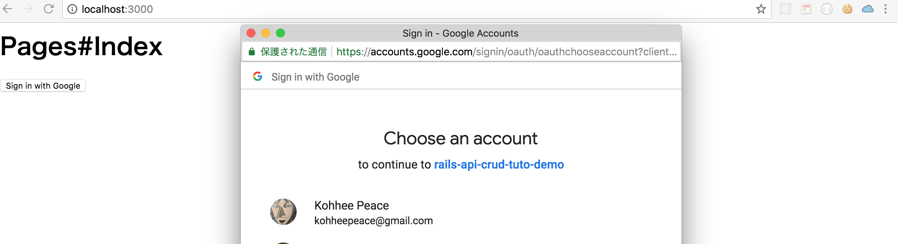
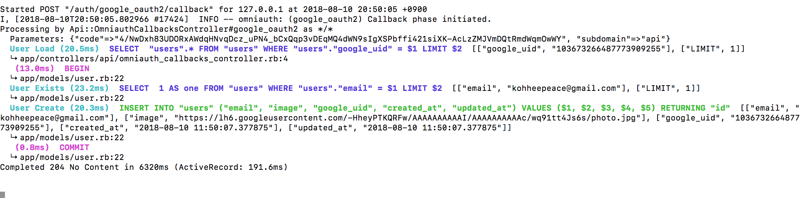

# Chap6 Create User

```text
rails g model User email:string:uniq image:string google_uid:string:uniq
```

```text
Running via Spring preloader in process 17255
      invoke  active_record
      create    db/migrate/20180810113846_create_users.rb
      create    app/models/user.rb
      invoke    rspec
      create      spec/models/user_spec.rb
      invoke      factory_bot
      create        spec/factories/users.rb
```

```text
rails db:migrate
```


### Find or Create User 



```ruby
class Api::OmniauthCallbacksController < ApplicationController
  def google_oauth2
    auth = request.env['omniauth.auth']
    user = User.find_by_google_uid(auth['uid']) || User.create_with_google_omniauth(auth)
  end
end
```








### Define Model method

`find_by_google_uid`

is rails method



so define `create_with_google_omniauth` 



```ruby
class User < ApplicationRecord
  validates :email, presence: true, uniqueness: true

  def self.create_with_google_omniauth(auth)
    create! do |user|
      user.google_uid = auth["uid"]
      user.email = auth["info"]["email"]
      user.image = auth["info"]["image"]
    end
  end
end
```




### Test !

```text
rails s
```





```text
rails c
User.all
```


It worked correctly!

In the next chapter, we understand what is needed for access\_token. 



```ruby
class Api::OmniauthCallbacksController < ApplicationController
  def google_oauth2
    auth = request.env['omniauth.auth']
    user = User.find_by_google_uid(auth['uid']) || User.create_with_google_omniauth(auth)
    # Create AccessToken and render to client
  end
end
```




