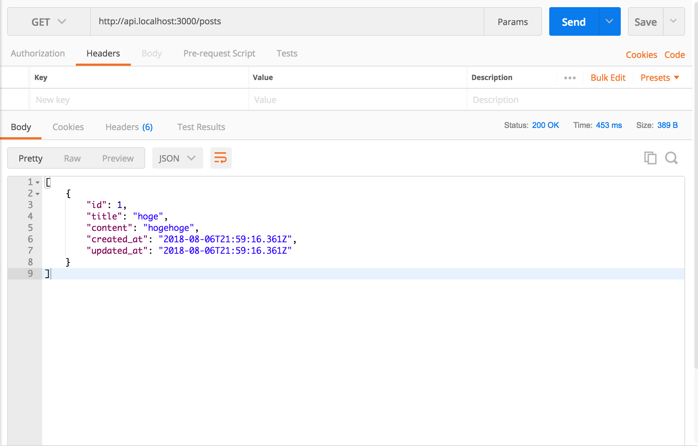

# Chap1 Create Post Model

### Create Post model

```text
rails g model Post title:string content:text
```

```text
Running via Spring preloader in process 54889
      invoke  active_record
      create    db/migrate/20180806180234_create_posts.rb
      create    app/models/post.rb
      invoke    rspec
      create      spec/models/post_spec.rb
      invoke      factory_bot
      create        spec/factories/posts.rb
```

```text
rails db:migrate
```


### Add routes for post



```ruby
Rails.application.routes.draw do
  namespace :api, path: '', constraints: { subdomain: 'api' } do
    resources :posts
  end
end
```



### Why subdomain ?

First, I created app by not using subdomains, like

```text
example.com/api/posts
```

But when deploy the app in production, I found it is convenient to use subdomain

```text
api.example.com/posts
```

### References









### Add controllers

```text
rails g controller api/posts
```

```text
Running via Spring preloader in process 59647
      create  app/controllers/api/posts_controller.rb
      invoke  rspec
      create    spec/controllers/api/posts_controller_spec.rb
```

### Add \#index action



```ruby
class Api::PostsController < ApplicationController
  def index
    render json: Post.all
  end
end
```



### Create Dummy Post

```text
rails c
Post.create(title:"hoge", content:"hogehoge")
```

### \*Rails Subdomain localhost issue

[https://gist.github.com/indiesquidge/b836647f851179589765\#file-subdomain-localhost-rails-5-md](https://gist.github.com/indiesquidge/b836647f851179589765#file-subdomain-localhost-rails-5-md)



```ruby
Rails.application.configure do
  ...
  config.action_dispatch.tld_length = 0
end
```




### Check it in browser

```text
rails s
```

[http://api.localhost:3000/posts.json](http://api.localhost:3000/posts.json)

### Check it by Postman




