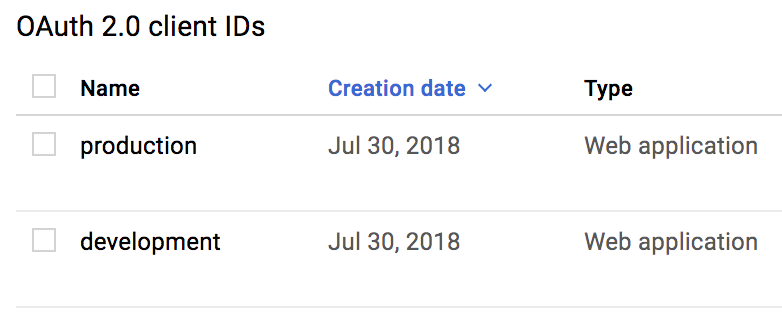

# Chap16 Heroku Deploy

```text
heroku create appname
```


```text
git push heroku master
```


```text
heroku run rake db:migrate
```


### Add google api key and secrets for production

Visit...

[https://console.developers.google.com/apis/credentials?project=rails-api-crud-tuto-demo](https://console.developers.google.com/apis/credentials?project=rails-api-crud-tuto-demo)






```text
development:
  GOOGLE_CLIENT_ID: "599452344425899-.apps..com"
  GOOGLE_CLIENT_SECRET: "fjioejfwe"

production:
  GOOGLE_CLIENT_ID: "745665442669-ir6a0pqtatp980m4amifveaqjug119s4.apps.googleusercontent.com"
  GOOGLE_CLIENT_SECRET: "j43ihfih34543439"

```



### Set Production Google oauth id and keys

```text
figaro heroku:set -e production
```


```yaml
emote: ###### WARNING:
remote: 
remote:        You set your `config.active_storage.service` to :local in production.
remote:        If you are uploading files to this app, they will not persist after the app
remote:        is restarted, on one-off dynos, or if the app has multiple dynos.
remote:        Heroku applications have an ephemeral file system. To
remote:        persist uploaded files, please use a service such as S3 and update your Rails
remote:        configuration.
remote:        
remote:        For more information can be found in this article:
remote:          https://devcenter.heroku.com/articles/active-storage-on-heroku
remote:        
remote: 
remote: ###### WARNING:
remote: 
remote:        We detected that some binary dependencies required to
remote:        use all the preview features of Active Storage are not
remote:        present on this system.
remote:        
remote:        For more information please see:
remote:          https://devcenter.heroku.com/articles/active-storage-on-heroku
remote:        
remote: 
remote: ###### WARNING:
remote: 
remote:        No Procfile detected, using the default web server.
remote:        We recommend explicitly declaring how to boot your server process via a Procfile.
remote:        https://devcenter.heroku.com/articles/ruby-default-web-server
remote: 
remote: 
remote: -----> Discovering process types
remote:        Procfile declares types     -> (none)
remote:        Default types for buildpack -> console, rake, web
remote: 
remote: -----> Compressing...
remote:        Done: 44.5M
remote: -----> Launching...
remote:        Released v6
remote:        https://blook-api.herokuapp.com/ deployed to Heroku
remote: 
remote: Verifying deploy... done.
```


### 1, 2 is related active\_storage



This is not need to fix because we don't use storage file.


### 3 No Procfile detected




### Resource







### Godaddy domain settings




